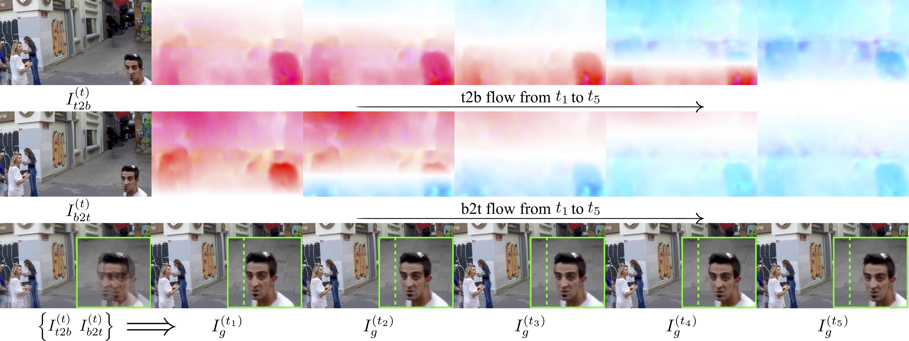
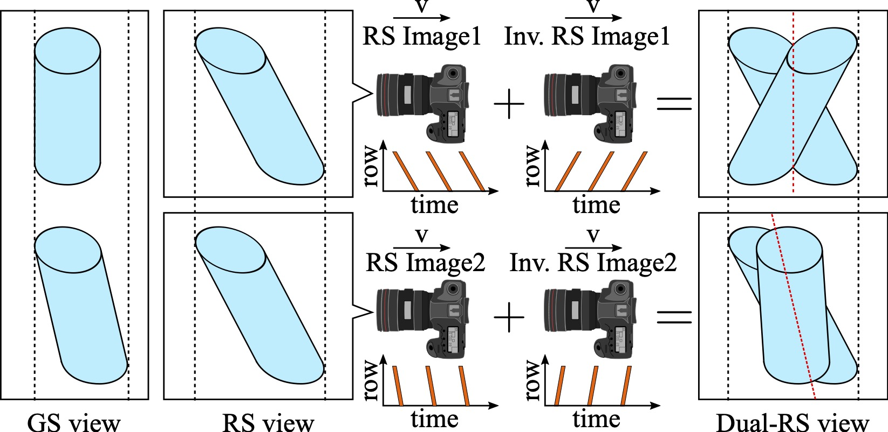

# Dual-Reversed-RS

#### :rocket: **[ECCV2022 Oral]** [Bringing Rolling Shutter Images Alive with Dual Reversed Distortion](https://arxiv.org/abs/2203.06451)

by [Zhihang Zhong](https://zzh-tech.github.io/), Mingdeng Cao, Xiao Sun, Zhirong Wu, Zhongyi Zhou, Yinqiang Zheng, Stephen Lin, and Imari Sato

:point_right: [Project website](https://zzh-tech.github.io/Dual-Reversed-RS/
), [Video demo](https://drive.google.com/file/d/13t98z4ODZbivoQ7Mrlua2WXZBSt0U6dy/view?usp=sharing)

Please leave a ⭐ if you like this project!

#### **TL;DR**:

Our goal is to address the challenging task of reversing rolling shutter (RS) scanning process, *i.e.*, extracting undistorted global shutter image sequence from images suffering from RS distortion.  



Because RS distortion is coupled with factors such as readout time, deadtime, and the relative velocity, models that only exploit the geometric correlation between temporally adjacent images (consecutive scheme) suffer from poor generalization. Although methods of consecutive scheme can correct RS images, they do not know how much correction is correct facing data beyond the dataset (*e.g.*, images captured with different readout setting). We name this as the **correction ambiguity problem**.  



Instead of consecutive scheme, we introduce another constraint setting that utilizes intra-frame spatial constraints of dual images taken simultaneously but with reversed distortion captured by top-to-bottom (t2b) and bottom-to-top (b2t) scanning. **Grounded on the symmetric and complementary nature of dual reversed distortion, we develop a novel end-to-end model, IFED, to overcome the correction ambiguity problem of this task and achieve better generalization and visual quality.** 


## Preparation

Please download the synthesized RS-GOPRO dataset from this [link](https://drive.google.com/file/d/1Txq0tU-1r3T2TjN-DQIe7YHyqwv9rCma/view?usp=sharing) and unzip it to a directory (*e.g., ./dataset/*).

Please download the pretrained checkpoints from this [link](https://drive.google.com/drive/folders/1HizPUOhC5nJ-cfyRbpmzKQTiXP-8Hj76?usp=sharing) and put these checkpoints under *./checkpoints/*.

#### Installation:

```shell
conda create -n dual-reversed-rs python=3.8
conda activate dual-reversed-rs
pip install torch==1.11.0+cu113 torchvision==0.12.0+cu113 torchaudio==0.11.0 --extra-index-url https://download.pytorch.org/whl/cu113
pip install tqdm opencv-python tensorboard lpips scikit-image thop
```

## Train

For more details of optional variables, please see [para/parameter.py](para/parameter.py).

```shell
CUDA_VISIBLE_DEVICES=0 python main.py --frames 5 --save_dir=./results/ifed_f5/ --data_root=./dataset/
```


## Evaluation

```shell
CUDA_VISIBLE_DEVICES=0 python main.py --frames 5 --data_root=./dataset/ --test_only --save_dir=./results/ifed_f5/eval/ test_save_dir=./results/ifed_f5/eval/ --test_checkpoint ./checkpoints/ifed_f5/model_best.pth.tar
```


## Inference

```shell
CUDA_VISIBLE_DEVICES=0 python inference.py --frames 9 --rs_img_t2b_path ./demo/s0_t2b.png --rs_img_b2t_path ./demo/s0_b2t.png --test_checkpoints ./checkpoint/ifed_f9/model_best.pth.tar --save_dir ./results/ifed_f9/s0/
```


(*P.S., because the framework is old, we currently only supports single GPU for training, evaluation and inference.*)


## Citation

If you find this repository useful, please consider citing:

```bibtex
@article{zhong2022bringing,
  title={Bringing rolling shutter images alive with dual reversed distortion},
  author={Zhong, Zhihang and Cao, Mingdeng and Sun, Xiao and Wu, Zhirong and Zhou, Zhongyi and Zheng, Yinqiang and Lin, Stephen and Sato, Imari},
  journal={arXiv preprint arXiv:2203.06451},
  year={2022}
}
```


## Acknowledgement

We thank the nice works mentioned below:

- The model designing is partially based on [DeepUnrollNet](https://github.com/ethliup/DeepUnrollNet) and [RIFE](https://github.com/megvii-research/ECCV2022-RIFE).

- The setup is partially inspired by [rs2cam](https://github.com/CenekAlbl/rs2cam).

- The dataset has a portion of the data from [GOPRO](https://seungjunnah.github.io/Datasets/gopro.html).
